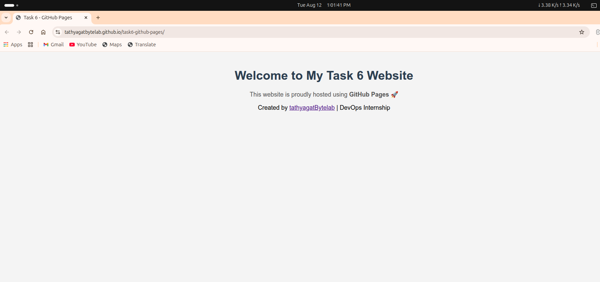
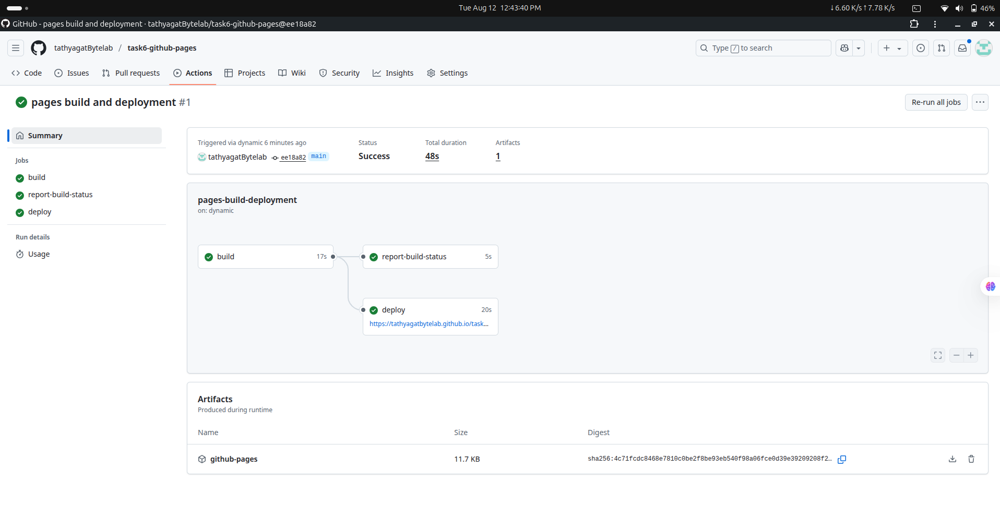

# 🚀 Task 6 - GitHub Pages Deployment

## 📌 Objective
Host a static website using **GitHub Pages** as part of the DevOps Internship Task 6.

---
## 📂 Project Structure
```
task6-github-pages/
├── index.html # Main HTML file
├── style.css # Styling file
├── screenshots/ # Folder for screenshots
│ ├── 1.png # Live website screenshot
│ └── 2.png # GitHub Actions deploy screenshot
└── README.md # Documentation file
 ```
## 🛠 Steps Followed

1. **Created Project Files**
   - `index.html` → Main webpage
   - `style.css` → Styling for the webpage

2. **Initialized Git Repository**
   ```
   git init
   git add .
   git commit -m "Initial commit for Task 6"
  
   ```
3. Created New GitHub Repository

-  Repo name: task6-github-pages

-  Pushed local project to GitHub.

4. Enabled GitHub Pages

- Go to Settings → Pages

- Source: main branch → / (root)

- Saved and waited for deployment.

5. Website Live

- Live URL: https://tathyagatBytelab.github.io/task6-github-pages/

## 📷 Screenshots

### 1. GitHub Pages Live Website


### 2. GitHub Actions Deployment Log


